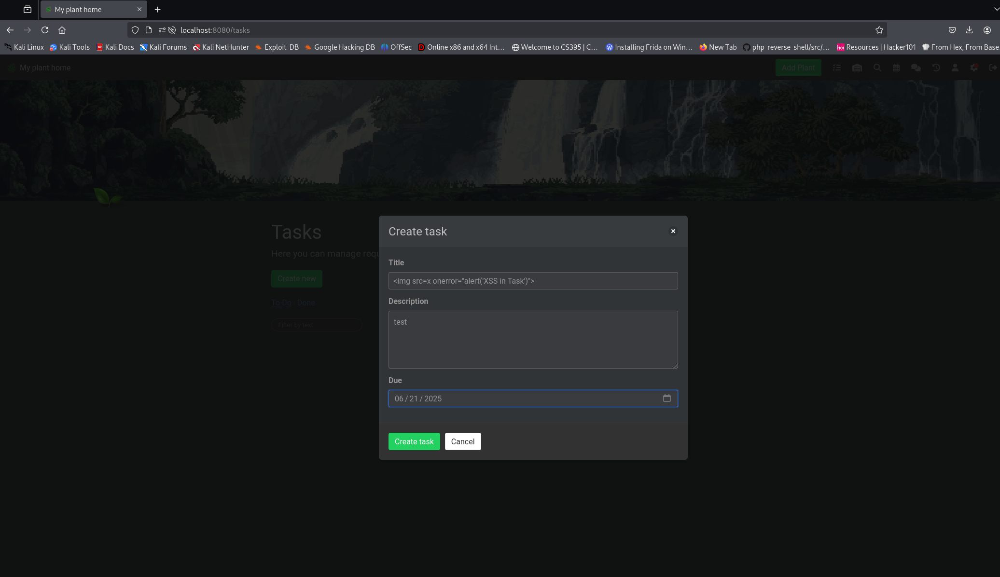
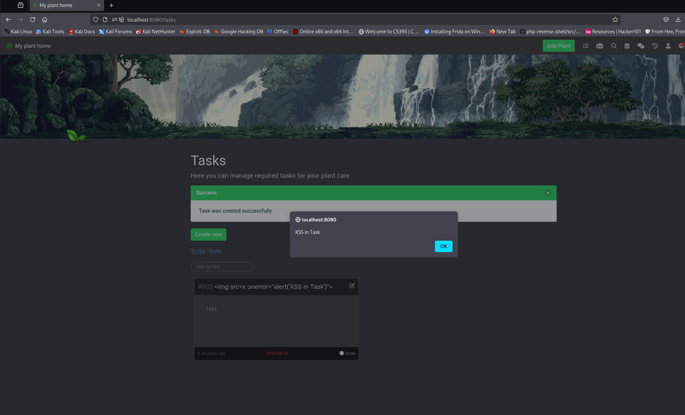
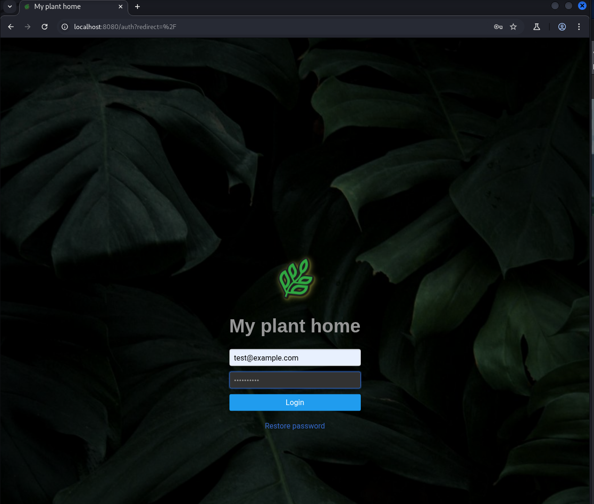
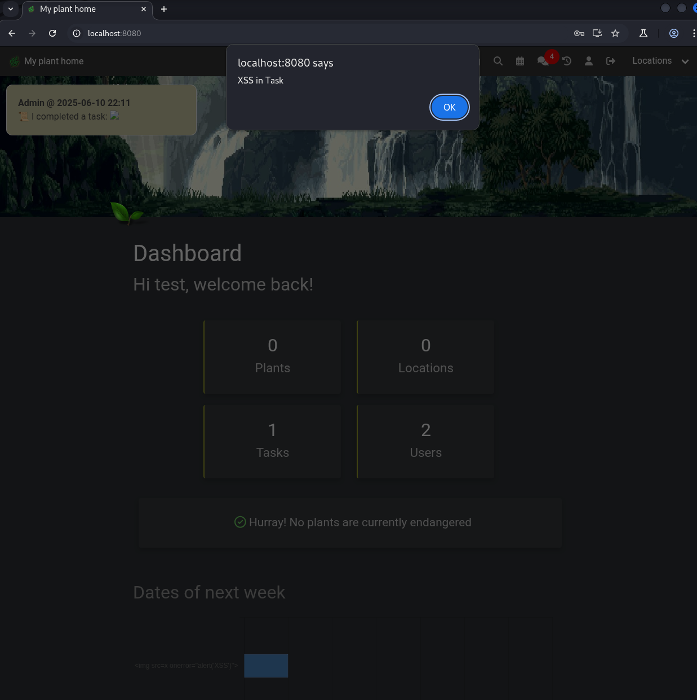

### CVE-2025-45313 - Stored Xss in createTask HortusFox-web v4.4

### 1. Executive Summary

A **persistent (stored) Cross-Site Scripting (XSS)** vulnerability in the “create task” functionality of hortusfox-web v4.4 allows any authenticated user to inject arbitrary JavaScript into the system chat. When the application broadcasts new-task messages, the unescaped task title executes in every recipient’s browser, enabling session hijacking, data theft, or privileged actions.
### 2. Vulnerability Details
1. In [createdTask()](https://github.com/danielbrendel/hortusfox-web/blob/5c2e5355c87f023c74a1dd0170555ef1afa403db/app/modules/TextBlockModule.php#L82) the user-supplied `$name` (task title) is interpolated without sanitization:
```php
    public static function createdTask($name, $url)
    {
        try {
            $text = __('tb.created_task', ['name' => $name, 'url' => $url]);

            static::addToChat($text, 'x1f4dc');
        } catch (\Exception $e) {
            throw $e;
        }
    }
```

2. the [addToChat()](https://github.com/danielbrendel/hortusfox-web/blob/5c2e5355c87f023c74a1dd0170555ef1afa403db/app/modules/TextBlockModule.php#L201) method concatenates and stores the raw message via a direct SQL insert:
```php
    public static function addToChat($message, $icon, $api = false)
    {
        try {
            if (!app('chat_system')) {
                return;
            }

            $user = UserModel::getAuthUser();
            if ((!$user) && (!$api)) {
                throw new \Exception('Invalid user');
            }

            $icon = html_entity_decode('&#' . $icon, ENT_COMPAT | ENT_QUOTES);

            ChatMsgModel::raw('INSERT INTO `@THIS` (userId, message, sysmsg, created_at) VALUES(?, ?, 1, CURRENT_TIMESTAMP)', [
                (($user) ? $user->get('id') : 0),
                $icon . ' ' . $message
            ]);
        } catch (\Exception $e) {
            throw $e;
        }
    }
}
```
No HTML-escaping or filtering is applied to $message

3. When chat messages are rendered, browsers interpret any `<script>` or event-handler attributes.

### 3. Proof-of-Concept
1. **Login** as any user.
    
2. **Create** a calendar event
	- Name:
```html

```
3. **Save** the event. Observe a new “system” chat entry flash to all connected users.
    
4. On next chat render, the injected `` tag fires, popping an alert.
		this also applies to any user not logged in they get xssed when they log in as well as any logged in user

### 4. Impact

- **Session Hijack:** Steal session cookies or CSRF tokens.
    
- **Privilege Escalation:** Admins see the same chat, so an attacker can target higher-privilege accounts.
    
- **Data Theft / Actions on Behalf:** Execute any JavaScript API calls in the user’s context.

### Screenshots

Xss payload is inserted into the title of the task


After Create task is clicked the xss is triggered


### Other User

Another user logs into the web app


As soon as they log in they are XSSed

