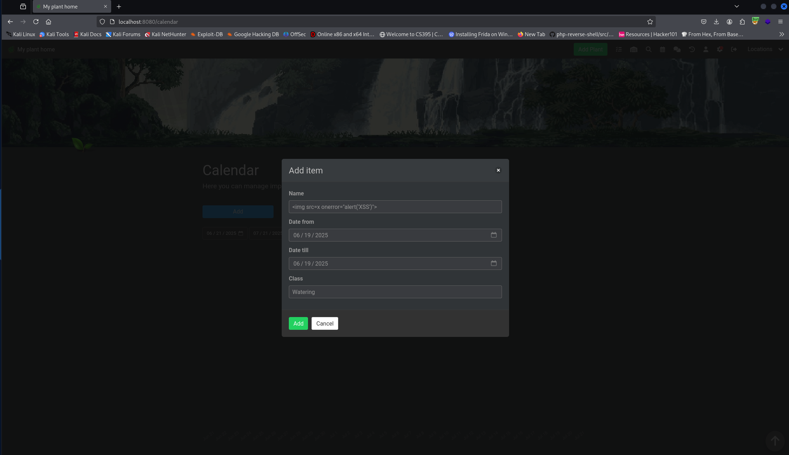
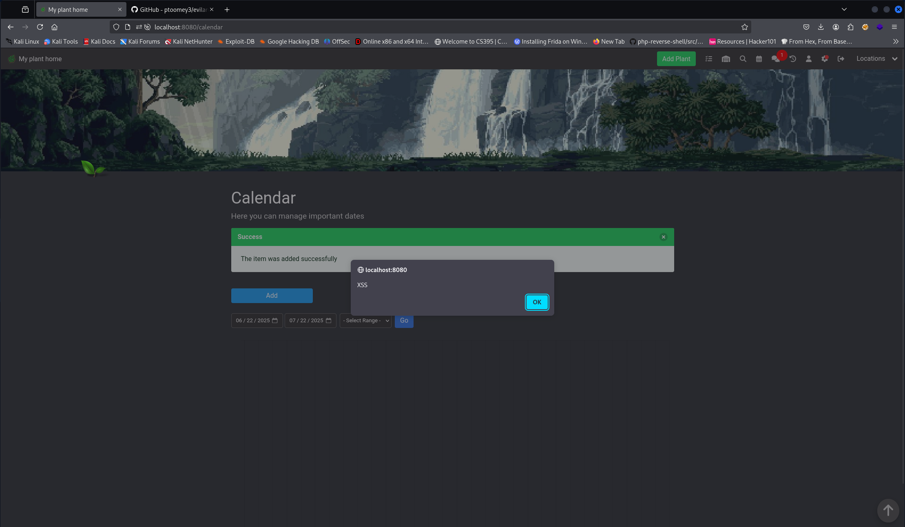
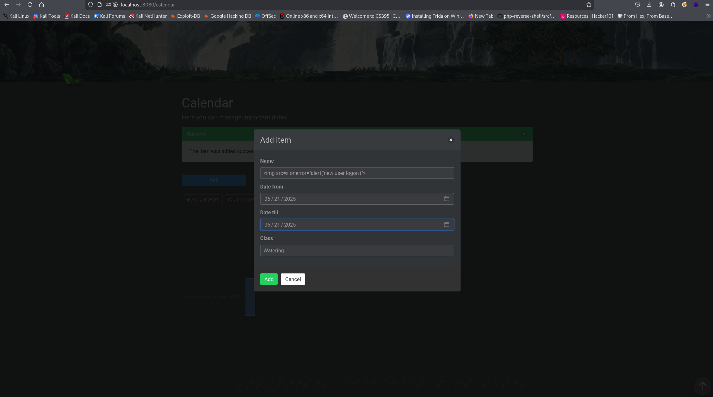
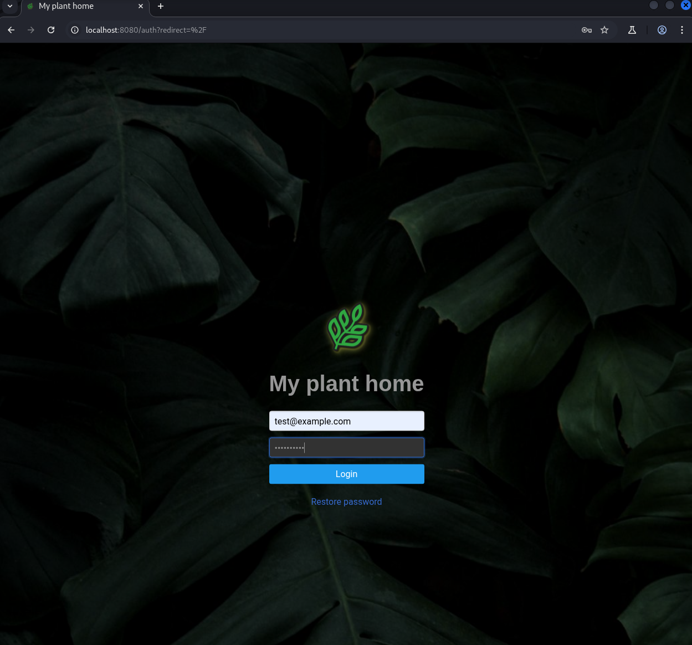
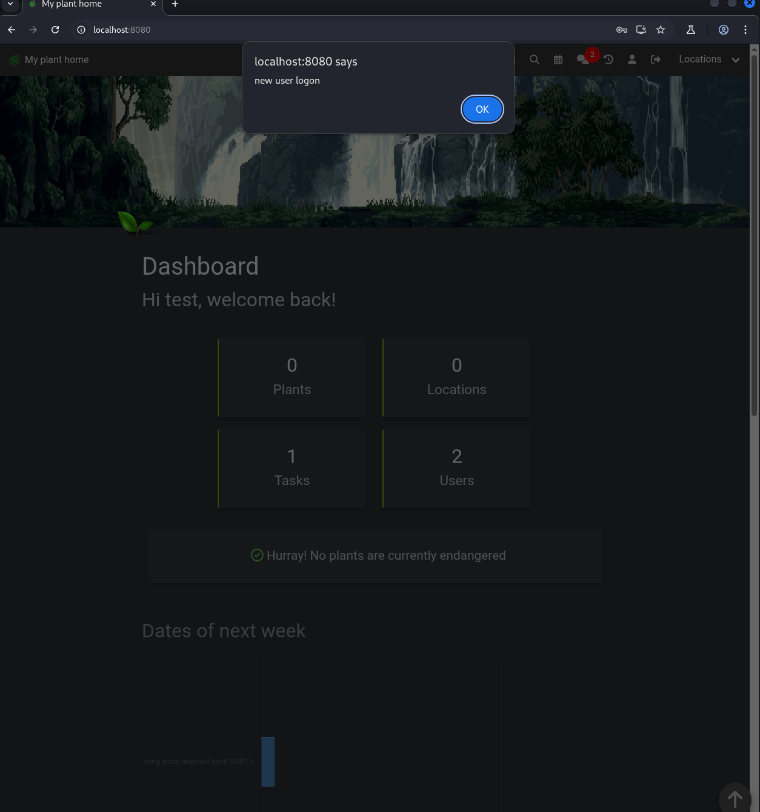

### CVE-2025-45314 - Stored Xss in addCalendarItem in HortusFox-web v4.4

### 1. Executive Summary

A **persistent (stored) Cross-Site Scripting (XSS)** vulnerability exists in the Calendar module of hortusfox-web v4.4. An authenticated user can craft a malicious event **name** containing HTML/JavaScript, which is saved into the database and then delivered to every user who loads or refreshes the chat UI. Because the chat message is rendered without proper escaping, the payload executes in each victim’s browser, enabling session hijacking, data exfiltration, or further privilege escalation.

### 2. Vulnerability Details

1. **User input** (`$name`) flows into [addedCalendarItem()](https://github.com/danielbrendel/hortusfox-web/blob/5c2e5355c87f023c74a1dd0170555ef1afa403db/app/modules/TextBlockModule.php#L15-L24) without validation.
```php
    public static function addedCalendarItem($name, $url)
    {
        try {
            $text = __('tb.added_calendar_item', ['name' => $name, 'url' => $url]);

            static::addToChat($text, 'x1f4c5');
        } catch (\Exception $e) {
            throw $e;
        }
    }
```
    
2. It’s interpolated into a localization string (`__()`) and passed, unescaped, into `addToChat()`.
    
3. [addToChat()](https://github.com/danielbrendel/hortusfox-web/blob/5c2e5355c87f023c74a1dd0170555ef1afa403db/app/modules/TextBlockModule.php#L201) writes it directly into the DB.
	```php
    public static function addToChat($message, $icon, $api = false)
    {
        try {
            if (!app('chat_system')) {
                return;
            }

            $user = UserModel::getAuthUser();
            if ((!$user) && (!$api)) {
                throw new \Exception('Invalid user');
            }

            $icon = html_entity_decode('&#' . $icon, ENT_COMPAT | ENT_QUOTES);

            ChatMsgModel::raw('INSERT INTO `@THIS` (userId, message, sysmsg, created_at) VALUES(?, ?, 1, CURRENT_TIMESTAMP)', [
                (($user) ? $user->get('id') : 0),
                $icon . ' ' . $message
            ]);
        } catch (\Exception $e) {
            throw $e;
        }
    }
}

	```

4.  When chat messages are rendered, browsers interpret any `<script>` or event-handler attributes.

### 3. Proof-of-Concept

1. **Login** as any user.
    
2. **Create** a calendar event
	- Name:
```html
`
```
1. **Save** the event. Observe a new “system” chat entry flash to all connected users.
    
2. On next chat render (page load or live update), the injected `` tag fires, popping an alert.
		this also applies to any user not logged in they get xssed when they log in as well as any logged in user

### 4. Impact

- **Session Hijack:** Steal session cookies or CSRF tokens.
    
- **Privilege Escalation:** Admins see the same chat, so an attacker can target higher-privilege accounts.
    
- **Data Theft / Actions on Behalf:** Execute any JavaScript API calls in the user’s context.

### Screenshots

Calendar Item is created


After clicking add the xss is executed

### New User Logging in Xss
New Calendar Item is created


Second non admin user logs in


As soon as they are logged in they are XSSed
 
