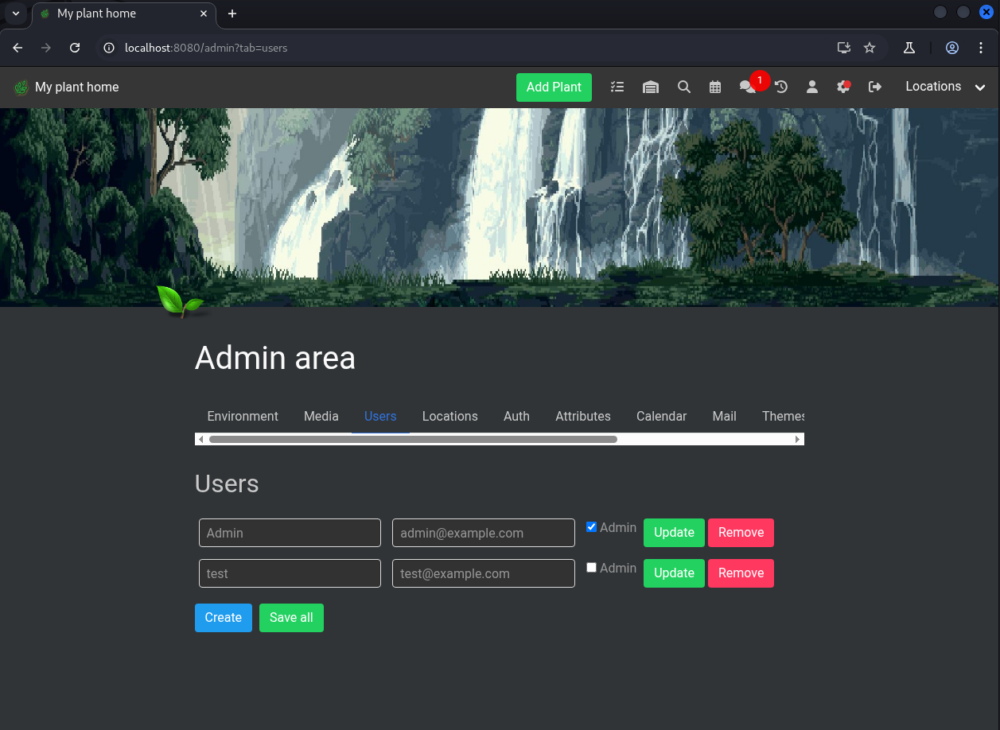
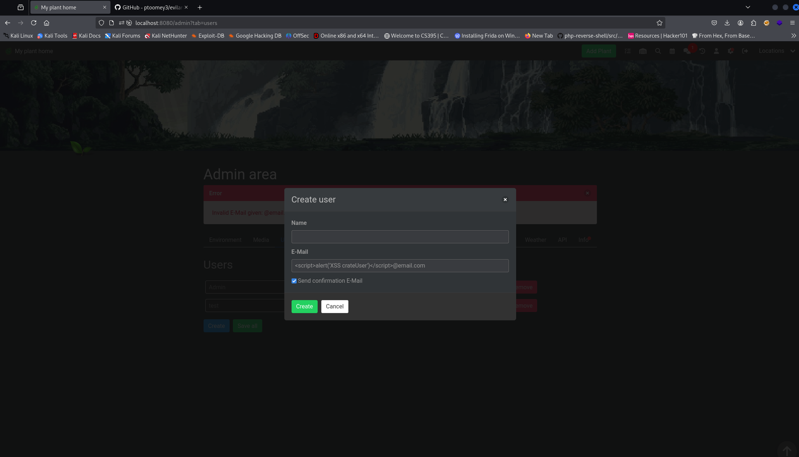
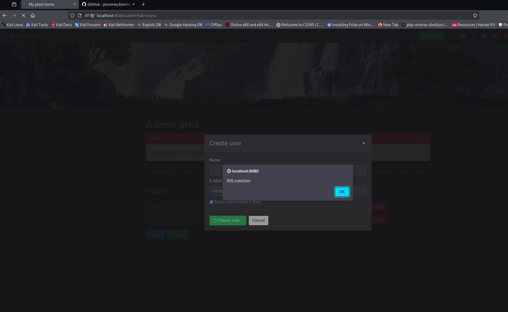

### CVE-2025-45315 - Reflected Xss in create user in HortusFox-web v4.4

### 1. Executive Summary

A **reflected XSS** issue exists in the admin user‐creation endpoint (`/admin/user/create`). If an administrator enters a crafted `email` value that triggers a validation error, that unsanitized string is echoed back in an error flash message. Because only the submitting admin ever sees it and it cannot be used to target other users, the overall impact is limited—hence a **Low** severity rating.

### 2. Vulnerability Details

In [admin,php](https://github.com/danielbrendel/hortusfox-web/blob/8ab851101a62d8eb311235c118eeeb32a9b36978/app/controller/admin.php) the [create_user()](https://github.com/danielbrendel/hortusfox-web/blob/8ab851101a62d8eb311235c118eeeb32a9b36978/app/controller/admin.php#L188) method catches exceptions and passes the raw exception message (which may include the unsanitized `email` input) directly into the flash message:
```php
	public function create_user($request)
	{
		try {
			$name = $request->params()->query('name', null);
			$email = $request->params()->query('email', null);
			$sendmail = (int)$request->params()->query('sendmail', 0);
			
			$password = UserModel::createUser($name, $email, $sendmail);

			FlashMessage::setMsg('success', __('app.user_created_successfully'));

			return redirect('/admin?tab=users' . (($password) ? '&user_password=' . $password : ''));
		} catch (\Exception $e) {
			FlashMessage::setMsg('error', $e->getMessage());
			return redirect('/admin?tab=users');
		}
	}
```
When a validation error occurs (e.g. duplicate email), the flash box renders the raw text, allowing an injected payload like:
```html
<script>alert('XSS crateUser')</script>@email.com
```
to execute in the admin’s own browser session.

### 3. Proof-of-Concept
1. **Log in** as an administrator.

2. **Submit** the user-creation form with:
```html
<script>alert('XSS crateUser')</script>@email.com
```

3. **Force** a validation error (e.g. reuse an existing email).

4. **Observe** the flash error box flash the raw input and run the script—only the submitting admin’s browser is affected.

### 4. Impact Assessment

- **Scope:** Affects only the submitting administrator’s session.
    
- **Privilege Required:** Admin-level access already needed.
    
- **Attack Vector:** Local (single request/response).
    
- **Impact:** Limited to showing an alert or similar; no ability to target other users or steal cookies, unless the admin manually copies/exposes them.

### Screenshots

Admin goes to crate user


The xss payload is put in the email field 


After create is clicked the xss is triggered

