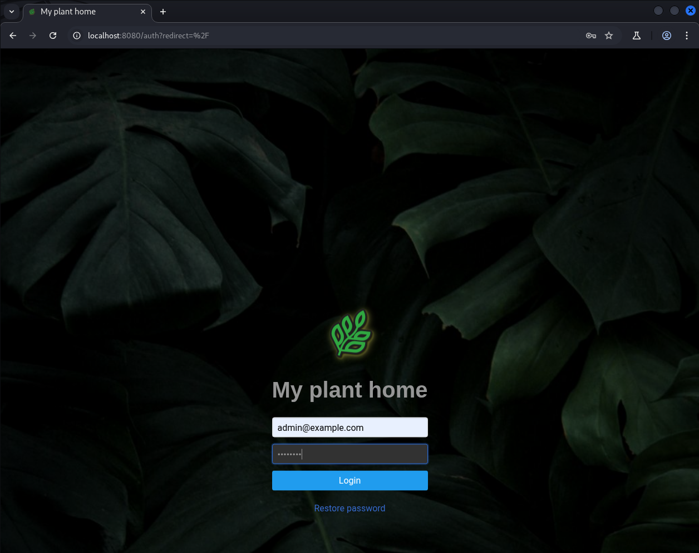
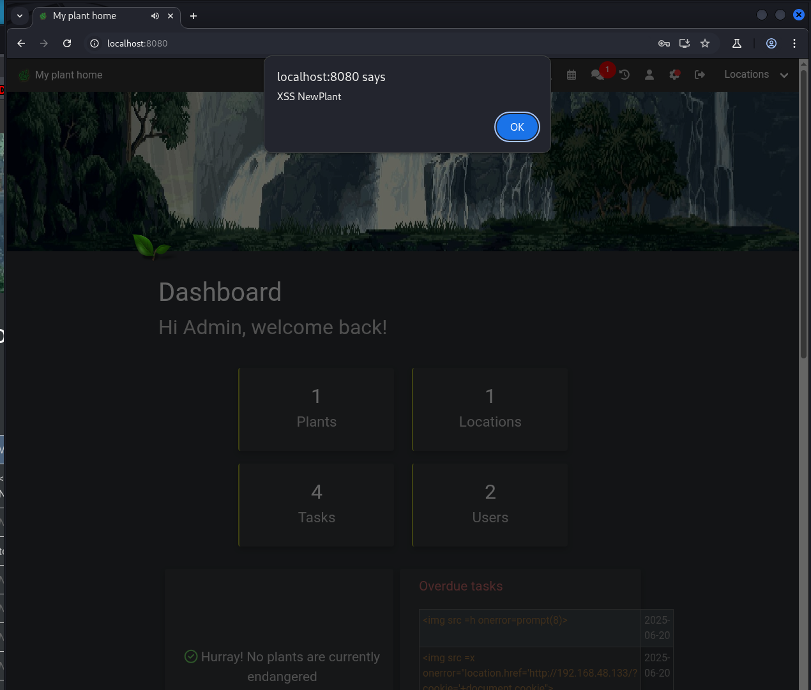

### CVE-2025-45316 - Stored Xss in Add Plant in HortusFox-web v4.4

### 1. Executive Summary

A **stored Cross-Site Scripting (XSS)** flaw exists in the “add new plant” functionality of hortusfox-web v4.4. An authenticated user may supply a crafted plant **name** containing HTML/JavaScript; this payload is saved to the database and later broadcast via the chat system without any escaping. When any user views the chat, the malicious script executes in their browser context.

### 2. Vulnerability Details
1. In [newPlant()](https://github.com/danielbrendel/hortusfox-web/blob/5c2e5355c87f023c74a1dd0170555ef1afa403db/app/modules/TextBlockModule.php#L15-L24) the untrusted `$name` is interpolated into a localization string:
```php
    public static function newPlant($name, $url)
    {
        try {
            $text = __('tb.added_new_plant', ['name' => $name, 'url' => $url]);

            static::addToChat($text, 'x1fab4');
        } catch (\Exception $e) {
            throw $e;
        }
    }
```

2. The [addToChat()](https://github.com/danielbrendel/hortusfox-web/blob/5c2e5355c87f023c74a1dd0170555ef1afa403db/app/modules/TextBlockModule.php#L201) method concatenates the raw message and stores it via SQL and No HTML-escaping is applied to `$message`.
```php
    public static function addToChat($message, $icon, $api = false)
    {
        try {
            if (!app('chat_system')) {
                return;
            }

            $user = UserModel::getAuthUser();
            if ((!$user) && (!$api)) {
                throw new \Exception('Invalid user');
            }

            $icon = html_entity_decode('&#' . $icon, ENT_COMPAT | ENT_QUOTES);

            ChatMsgModel::raw('INSERT INTO `@THIS` (userId, message, sysmsg, created_at) VALUES(?, ?, 1, CURRENT_TIMESTAMP)', [
                (($user) ? $user->get('id') : 0),
                $icon . ' ' . $message
            ]);
        } catch (\Exception $e) {
            throw $e;
        }
    }
}
```

3. Stored messages are retrieved in **`ChatMsgModel`** and output in the chat view  with no sanitization, allowing scripts or event handlers to run.

### 3. Proof-of-Concept
1. **Authenticate** as any valid user.

2. **Add** a new plant via the web UI
```html

```

3. **Submit** the form.

4. **Observe** a system chat notification including the injected `` tag flash to the user that submitted and new users logging in.

### 4. Impact Assessment

- **Session Hijacking:** Steal cookies or CSRF tokens via JavaScript.
    
- **Privilege Escalation:** Admins and other privileged users receive the same chat.
    
- **Data Exfiltration & Unauthorized Actions:** Scripts can invoke application APIs to read or modify data in the victim’s context.

### Screenshots

A new plant is added with the XSS payload by test user


After clicking add the xss is executed


### User Logging in

Admin logs in


Admin is xssed by non admin user

