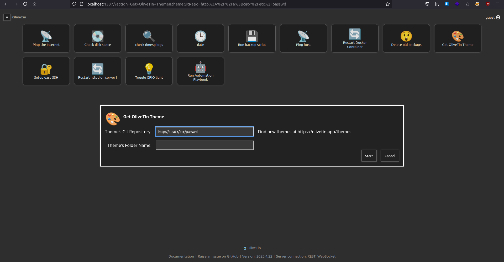
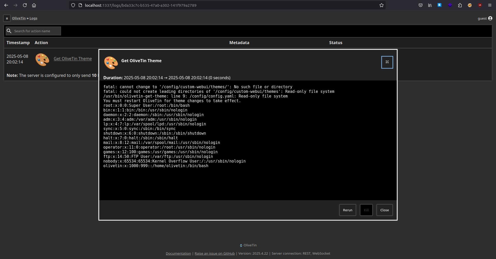

# Introduction
In this post, we'll be exploring a critical security vulnerability found in OliveTin, an open-source tool designed for managing and executing commands. This vulnerability, a classic example of **command injection**, was discovered during an analysis of how OliveTin processes user input in its predefined actions, such as the `olivetin-get-theme` action. We'll break down how the vulnerability occurs, reference the relevant source code, and discuss the steps needed to mitigate the issue.

# The Vulnerability
At its core, the issue lies in how OliveTin handles user-supplied URL arguments, specifically in the `themeGitRepo` field, which is part of the `olivetin-get-theme` action. The problem occurs because OliveTin fails to sanitize or escape the input before executing it in a shell.

Here's the breakdown:

- **User input**: The user can supply a URL for the `themeGitRepo` argument.
    
- **Validation**: The application uses a function, `typeSafetyCheckUrl`, to validate that the provided URL is correctly formed.
    
- **Execution**: Once validated, the URL is used in a shell command without proper escaping.
    

This setup creates an opportunity for attackers to inject malicious commands into the URL, which are then executed by the system. For example, an attacker could submit a URL like `http://a:cat</etc/passwd`, which would pass the URL validation but still execute the `cat` command on the server, potentially disclosing sensitive information such as `/etc/passwd`.

## Step-by-Step Breakdown
#### 1. **URL Argument Handling in `arguments.go`**

The key part of the code responsible for validating the URL argument is in the `typeSafetyCheckUrl` function. This function attempts to validate the input using `url.ParseRequestURI`, which checks whether the URL is well-formed. Here's the relevant portion of the code:
```go
func typeSafetyCheckUrl(value string) error {
    _, err := url.ParseRequestURI(value)
    return err
}
```
https://github.com/OliveTin/OliveTin/blob/8c073bf45fca6c6eda4e8a9feb182433277343ee/service/internal/executor/arguments.go#L211

While this method checks for the structural correctness of the URL, it does **not** account for the security implications of passing URLs into shell commands. As such, URLs containing special characters such as `;`, `$()`,  `<`  and `>` can still be exploited for command injection.

#### 2. **Shell Command Execution**

Once the URL argument is validated, it's included in the final shell command that OliveTin executes. The critical part of the code here is in the `stepExec` function:
https://github.com/OliveTin/OliveTin/blob/8c073bf45fca6c6eda4e8a9feb182433277343ee/service/internal/executor/executor_unix.go#L18
```go
cmd := exec.CommandContext(ctx, "sh", "-c", finalParsedCommand)
```

In this step, the `finalParsedCommand`, which may contain the user-supplied URL, is passed directly to the shell (`sh -c`), where the shell interprets any special characters. Without proper sanitization or escaping, an attacker can inject arbitrary commands, such as `$(id)` or `;cat /etc/passwd`, which will be executed by the system.

#### 3. **The Path to Exploitation**

Let's walk through an example of how an attacker could exploit this vulnerability:

1. The attacker submits a URL like `http://a:cat</etc/passwd` to `/?action=Get+OliveTin+Theme`.
    
2. The URL passes the `typeSafetyCheckUrl` validation because `url.ParseRequestURI` only checks if the URL is well-formed and does not account for shell metacharacters.
    
3. The URL is then incorporated into the shell command. Since `cat</etc/passwd` is a valid shell command, it will be executed when the final command is run.
    
4. The attacker can then gain access to sensitive system files like `/etc/passwd`, potentially leaking user credentials As well as full system comprimise 

# Screenshots



