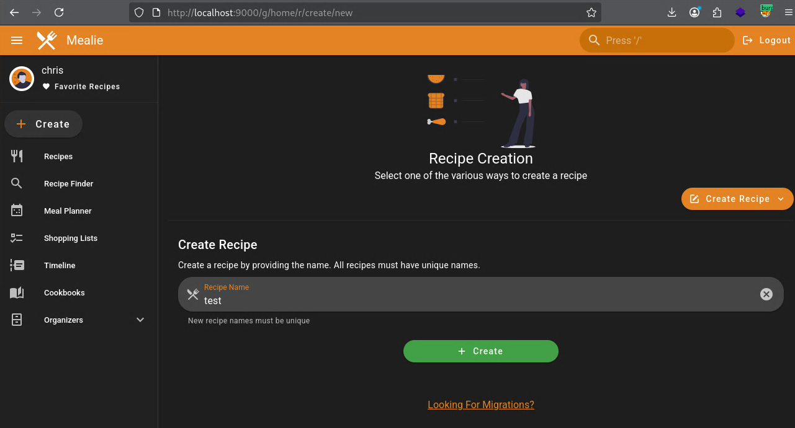
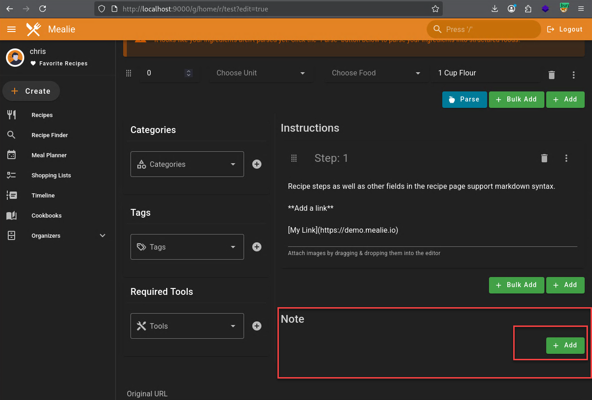
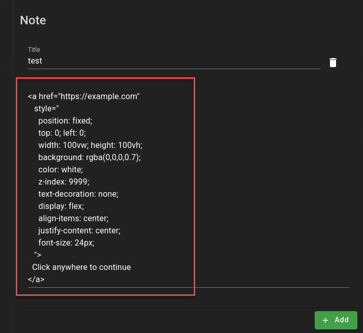
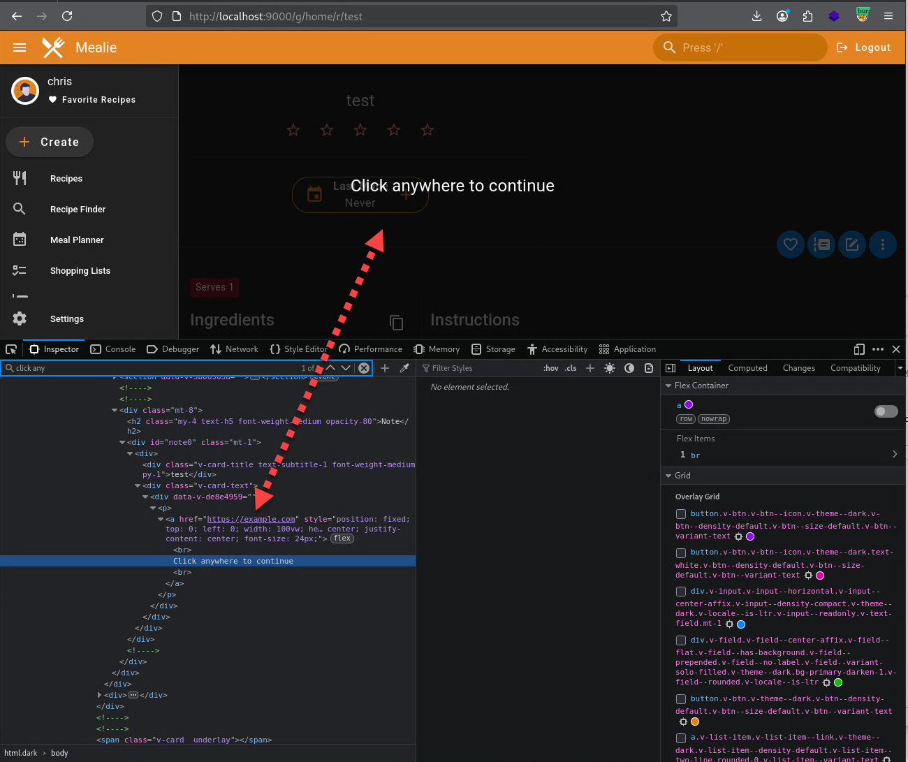
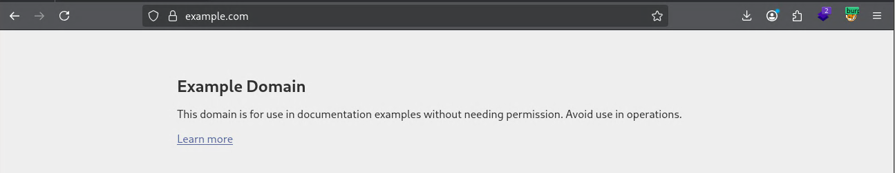

# CVE-2025-70296

## Summary

Mealie 3.3.1 was identified as rendering user-supplied HTML in the Recipe Notes field without sufficient sanitization. This allows stored HTML injection that can be used to alter the user interface when affected recipes are viewed.

## Affected Version

Mealie 3.3.1 (self-hosted)
Earlier versions may also be affected.

## Vulnerability Details

Mealie allows users to enter free-form content in the Recipe Notes field. In the affected version, this content is rendered without adequate HTML sanitization when a recipe is viewed.

As a result, attacker-controlled HTML and CSS may be injected and stored. When another user views the affected recipe, the injected content is rendered as part of the page. While execution is limited to HTML and CSS (no JavaScript execution was observed), the injected content can significantly alter the appearance and behavior of the recipe view.

## Impact

An authenticated attacker with permission to create or edit recipes may be able to:

  Overlay or obscure legitimate content within the recipe view

  Intercept user interaction within the recipe interface

  Redirect users to external pages using standard HTML links

  Degrade usability of affected recipes (UI-level denial of service)

  Facilitate phishing or social-engineering attacks

## Resolution

Fixed in v3.8.0

## STEPS TO REPRODUCE
After logging into the application the user can click on Create.


We can enter any name for the recipe and click on the green button Create.


We can scroll down the notes section and we can click on the green add button.


We can change the title to whatever we want in this case test the note section we will use the following html code
```html
<a href="https://example.com"
   style="
     position: fixed;
     top: 0; left: 0;
     width: 100vw; height: 100vh;
     background: rgba(0,0,0,0.7);
     color: white;
     z-index: 9999;
     text-decoration: none;
     display: flex;
     align-items: center;
     justify-content: center;
     font-size: 24px;
   ">
  Click anywhere to continue
</a>
```


After adding the payload and then clicking on save.


After clicking on save we can see that the recipies window is completely taken over and clicking inside the recipie window will force the user to example.com


example.com

