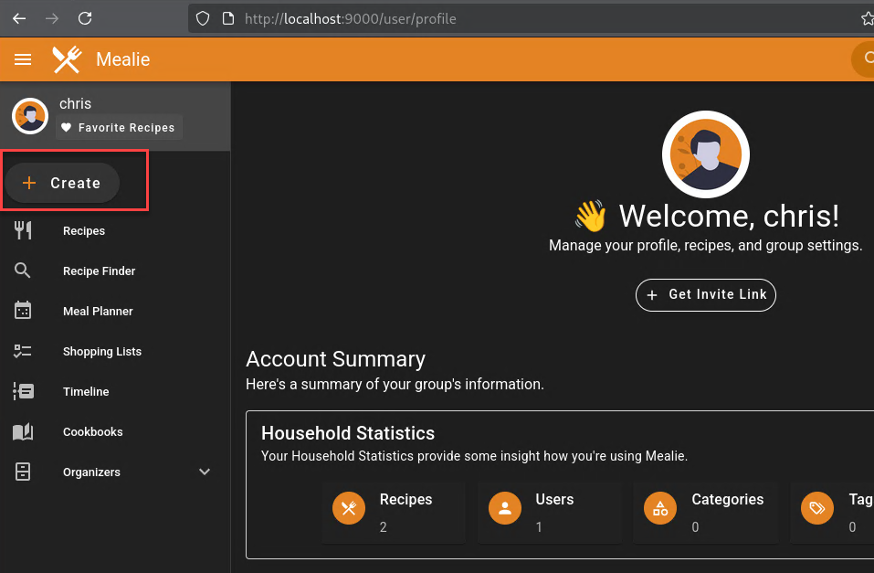
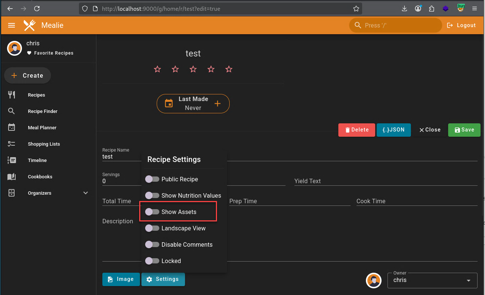
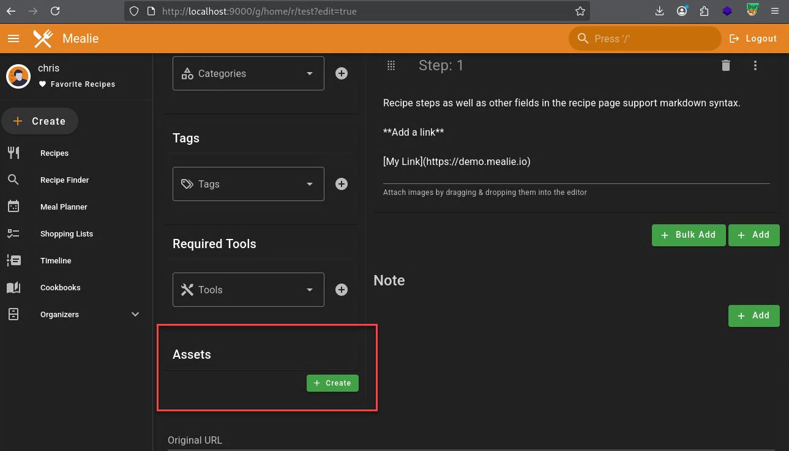
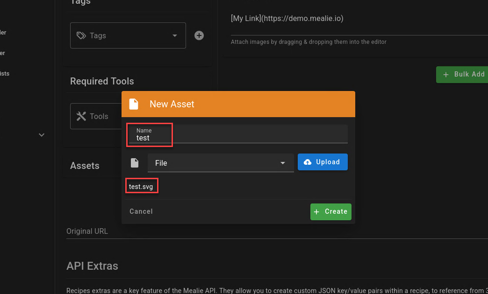
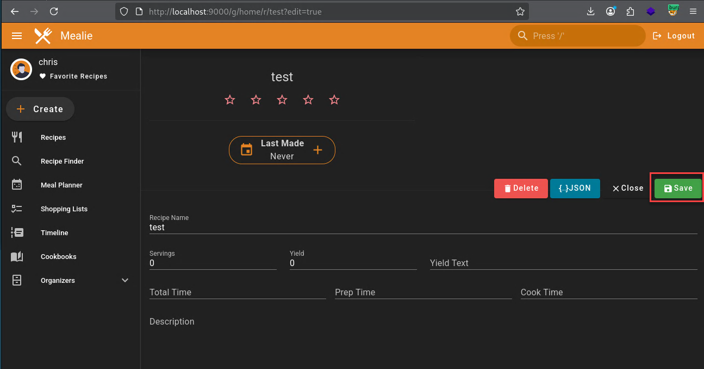
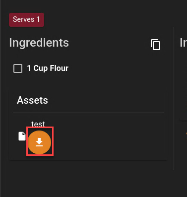
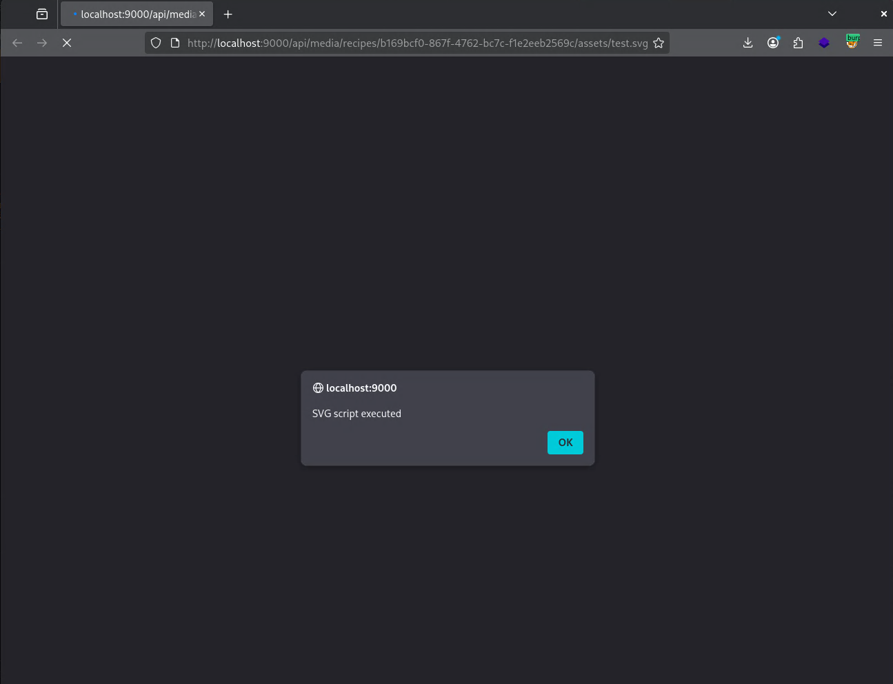

# CVE-2025-70297

## Summary

Mealie 3.3.1 was identified as serving certain user-uploaded SVG files inline from the application origin without sufficient sanitization or download enforcement. This behavior can allow client-side script execution when affected SVG files are viewed.

## Affected Version

Mealie 3.3.1 (self-hosted)
Earlier versions may also be affected.

## Vulnerability Details

Mealie allows users to upload SVG files as recipe assets that are later served directly from the application origin. In the affected version, uploaded SVG files are rendered inline and delivered with an executable SVG content type.

Because SVG supports embedded scripting, a malicious SVG containing inline script elements may execute when the file is viewed in a browser context. As the file is delivered from the same origin as authenticated application pages, script execution occurs within the user’s session context.

## Impact

An authenticated attacker who can upload SVG files may be able to:

  Execute arbitrary client-side JavaScript when the SVG is viewed

  Perform actions in the context of a victim’s authenticated session

  Facilitate phishing or social-engineering attacks

  Undermine trust in rendered application content

## Resolution

Fixed in v3.6.0

## STEPS TO REPRODUCE
After logging into the application the user can click on Create.


We can enter any name for the recipe and click on the green button Create


After creating the new recipe we can click on setting and make sure to select Show Assets


Then we can scroll down to the Assets field and click on create 


We are using the following SVG file
```
<svg version="1.1" baseProfile="full" xmlns="http://www.w3.org/2000/svg">
  <rect width="300" height="100" style="fill:rgb(0,0,255);stroke-width:3;stroke:rgb(0,0,0)"/>
  <script type="text/javascript">alert('SVG script executed');</script>
</svg>
```

We can upload this by giving it a name in this case test and click upload to select it from the file system 


After this we can click on the save icon to save the changes we have made so far.


After saving the changes we can then click on the arrow in the orange circle to trigger the XSS.


XSS on http://localhost:9000/api/media/recipes/b169bcf0-867f-4762-bc7c-f1e2eeb2569c/assets/test.svg

